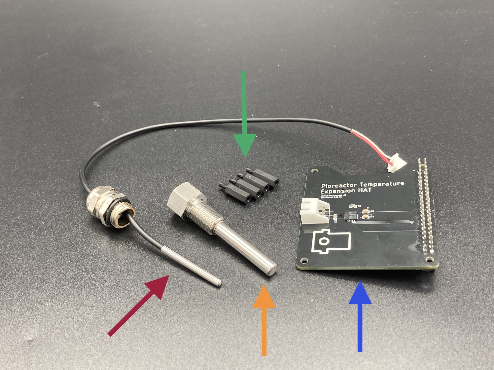

# Temperature Expansion Kit

### Pt1000 probe and cable

Need a 3-wire Pt1000 probe with jst connector. 

We Purchased from [here](https://www.alibaba.com/product-detail/GAIMC-Customized-waterproof-ClassA-PT1000-PT100_1600338752153.html?spm=a2756.trade-list-buyer.0.0.289276e9jdTwxA) 

 - 5mm diameter 47mm length hot sleeve with g1/8 threads
 - 3mm diameter probe
